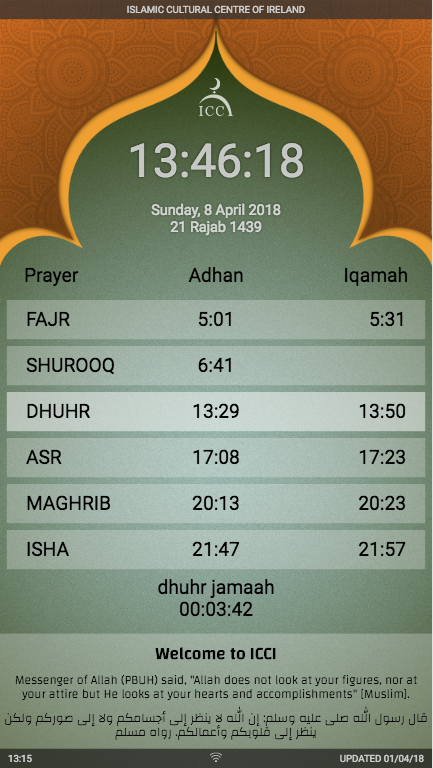

# Prayer timetable

Muslim prayer timetable app for deployment on Raspberry Pi (or similar). It is meant to be used on public displays to show your local community's prayer times. Can be used in masjids, mosques or even home. Optimised for Full HD screens. 

It uses React for frontend rendering and momentjs for time manipulation. Please note that this is at alpha stage and built specifically for my own needs.

This software is provided as-is, with no warranty of any kind. I provide it for free and do not expect and ask for any compensation. What's more, I will help you setup your own presentation screen and even install for free, but you will cover the postal bills in case you send me your own Raspberry Pi for setup.

Instructions on full deployment coming some time.

## Quick Start

### Standalone app:

git clone https://github.com/ench0/prayer-timetable-react
(modify to your own needs)
yarn build

### Note
This app should be used in conjuction with your own API from the website etc. For standalone app with vanilla JS and authentication, check prayer-timetable npm package.

## Features
* Prayer times
* Jamaah times
* Jamaah calculation offsets/methods
* Automatic refresh of frontend after backend/admin update
* Next prayer countdown
* Jummuah notification
* Themes (coming soon)
* Announcements/messages
* Mobile view/app (coming soon)
* Hijri dates
* Hijri offset
* Next day starts after isha iqamah

## How can you help
  The timetable app currently specifically targets my own mosque. If you like your city/language to be included, please contact me and send your own timetable. Use examples from other city to figure out the JSON format. You are responsible for accuracy of the data.

## Tools and libraries used
* NodeJS
* Moment JS, Moment Timezone, Moment Hijri
* OpenSans fonts
* Changa fonts
* Freepik images for backgrounds (soon)

## API example
    {
      "name":"ICCI Timetable",
      "settings": {
        "title": "Islamic Cultural Centre",
        "city": "dublin",
        "hijrioffset": "-1",
        "text": {
          "en": "Messenger of Allah (PBUH) said, \"Allah does not look at your figures, nor at your attire but He looks at your hearts and accomplishments\" [Muslim].",
          "ar": "قال رسول الله صلى  عليه وسلم: إن الله لا ينظر إلى أجسامكم ولا إلى صوركم ولكن ينظر إلى قلوبكم وأعمالكم. رواه مسلم"
        },
        "announcement": "Welcome to our centre!",
        "jummuahtime":"13:15",
        "join":"",
        "jamaahmethods":["afterthis","","fixed","afterthis","afterthis","afterthis"],
        "jamaahoffsets":[[0,30],["",""],[13,50],[0,15],[0,10],[0,10]],
        "lang":"en",
        "labels": {
          "jummuah":"Jummuah time",
          "prayer":"Prayer",
          "adhan":"Adhan",
          "iqamah":"Iqamah",
          "prepare":"Prepare for",
          "ramadancountdown":"until Ramadan",
          "names":["fajr","shurooq","dhuhr","asr","maghrib","isha"]
        },
        "updated": 1522587167    },
        "timetable": {
          "1":{"1":[[6,43],[8,37],[12,30],[14,3],[16,19],[18,7]],"2":[[6,43],[8,37],[12,31],[14,3],[16,20],[18,8]],"3":[[6,43],[8,37],[12,31],[14,4],[16,22],[18,9]],"4":[[6,43],[8,37],[12,32],[14,5],[16,23],[18,10]],"5":[[6,43],[8,36],[12,32],[14,6],[16,24],[18,11]],"6":[[6,43],[8,36],[12,32],[14,7],[16,25],[18,12]],"7":[[6,42],[8,35],[12,33],[14,8],[16,26],[18,13]],"8":[[6,42],[8,35],[12,33],[14,10],[16,28],[18,14]],"9":[[6,42],[8,34],[12,34],[14,11],[16,29],[18,15]],"10":[[6,41],[8,34],[12,34],[14,12],[16,31],[18,17]],"11":[[6,41],[8,33],[12,34],[14,13],[16,32],[18,18]],"12":[[6,41],[8,32],[12,35],[14,14],[16,34],[18,19]],"13":[[6,40],[8,31],[12,35],[14,16],[16,35],[18,20]],"14":[[6,39],[8,31],[12,36],[14,17],[16,37],[18,22]],"15":[[6,39],[8,30],[12,36],[14,18],[16,38],[18,23]],"16":[[6,38],[8,29],[12,36],[14,19],[16,40],[18,24]],"17":[[6,37],[8,28],[12,37],[14,21],[16,41],[18,26]],"18":[[6,37],[8,27],[12,37],[14,22],[16,43],[18,27]],"19":[[6,36],[8,26],[12,37],[14,24],[16,45],[18,28]],"20":[[6,35],[8,25],[12,38],[14,25],[16,47],[18,30]],"21":[[6,34],[8,23],[12,38],[14,26],[16,48],[18,31]],"22":[[6,33],[8,22],[12,38],[14,28],[16,50],[18,33]],"23":[[6,32],[8,21],[12,38],[14,29],[16,52],[18,34]],"24":[[6,31],[8,20],[12,39],[14,31],[16,54],[18,36]],"25":[[6,30],[8,18],[12,39],[14,32],[16,56],[18,37]],"26":[[6,29],[8,17],[12,39],[14,34],[16,57],[18,39]],"27":[[6,28],[8,15],[12,39],[14,35],[16,59],[18,41]],"28":[[6,27],[8,14],[12,40],[14,37],[17,1],[18,42]],"29":[[6,26],[8,12],[12,40],[14,38],[17,3],[18,44]],"30":[[6,24],[8,11],[12,40],[14,40],[17,5],[18,45]],"31":[[6,23],[8,9],[12,40],[14,41],[17,7],[18,47]]},

          "2":{"1":
          ...
        }
    }

* 'jummuahtime' - self explanatory, needs to be in 24-hour format.
* 'join' - should maghrib and isha prayers be joined (in summer time for example).
* 'jamaahmethods' - afterthis: iqamah time hours and minutes after the adhan; fixed: fixed time for iqamah; beforenext: iqamah is hours and minutes before next prayer's adhan.
* 'jamaahoffsets' - define the timings in hours and minutes for the above corresponding methods.
* 'updated' - last time the API was updated, in unix time (seconds).
* 'timetable' - first '1' means January, second '1' means first. What follows is an array of times - in '[6,43] - '6' is fajr hour, '43' is fajr minutes. Etc, etc.

## Screenshots

